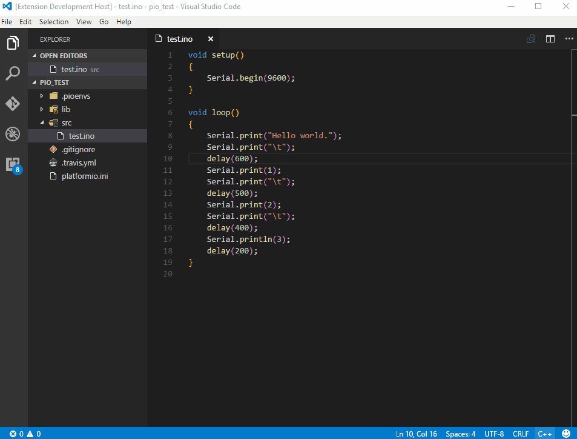
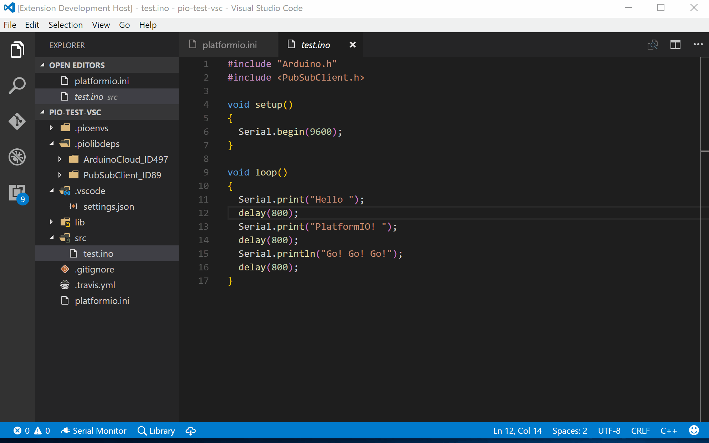

# PlatformIO

[](https://gitter.im/formulahendry/vscode-platformio?utm_source=badge&utm_medium=badge&utm_campaign=pr-badge&utm_content=badge) [](https://marketplace.visualstudio.com/items?itemName=formulahendry.platformio) [](https://marketplace.visualstudio.com/items?itemName=formulahendry.platformio) [](https://marketplace.visualstudio.com/items?itemName=formulahendry.platformio) [](https://travis-ci.org/formulahendry/vscode-platformio)

Integrate [PlatformIO](http://platformio.org/) into Visual Studio Code on top of [PlatformIO Core](http://docs.platformio.org/en/stable/core.html). Cross-platform Build System without external dependencies to the OS software: 350+ embedded boards, 20+ development platforms, 10+ frameworks. Arduino and ARM mbed compatible.

*Atmel AVR & SAM, Espressif 8266 & 32, Freescale Kinetis, Intel ARC32, Lattice iCE40, Microchip PIC32, Nordic nRF51, NXP LPC, Silicon Labs EFM32, ST STM32, TI MSP430 & Tiva, Teensy, Arduino, ARM mbed, libOpenCM3, ESP8266, etc.*

## Features

* Build PlatformIO project specified in [Project Configuration File platformio.ini](http://docs.platformio.org/en/stable/projectconf.html#projectconf)
* Upload firmware to devices specified in [Project Configuration File platformio.ini](http://docs.platformio.org/en/stable/projectconf.html#projectconf)
* Open Serial Monitor
* Set baud rate for Serial Monitor
* Search for library in [PlatformIO Library Registry](http://platformio.org/lib)
* Install library from [PlatformIO Library Registry](http://platformio.org/lib)
* Quick way to open PlatformIO Terminal
* Automatically or manually add Include Path to `c_cpp_properties.json` for [C/C++ extension](https://marketplace.visualstudio.com/items?itemName=ms-vscode.cpptools)
* Combined `Build`, `Upload` and `Open Serial Monitor` with one command

## Prerequisites

* Install [PlatformIO Core](http://docs.platformio.org/en/stable/installation.html)

## Setup

* Use existing project

  If you have an existing PlatformIO project, open the project folder directly in VS Code

* Create new project

  In terminal, run `platformio init --board <your_board_identifier>` to initialize a new PlatformIO project, then open the project folder in VS Code. Refer to [User Guide](http://docs.platformio.org/en/stable/userguide/cmd_init.html) for `platformio init` command. For how to find Board Identifier, you could refer to [this](http://docs.platformio.org/en/stable/quickstart.html#board-identifier).

## Usage

* **Build PlatformIO project**: Use shortcut `Ctrl+Alt+B`, or press `F1` and then select/type `PlatformIO: Build`, or right click the Text Editor and then click `PlatformIO: Build` in context menu


* **Upload firmware to devices**: Use shortcut `Ctrl+Alt+U`, or press `F1` and then select/type `PlatformIO: Upload`, or right click the Text Editor and then click `PlatformIO: Upload` in context menu



* **Open Serial Monitor**: Use shortcut `Ctrl+Alt+S`, or press `F1` and then select/type `PlatformIO: Open Serial Monitor`, or right click the Text Editor and then click `PlatformIO: Open Serial Monitor` in context menu


* **Search for library**: Click the `Library` item in the Status Bar at the bottom, or press `F1` and then select/type `PlatformIO: Search Library`, then type the query to search for library. Refer to the [User Guide](http://docs.platformio.org/en/latest/userguide/lib/cmd_search.html#description) for the query syntax.


* **Install library**: Click the `Download` icon in the Status Bar at the bottom, or press `F1` and then select/type `PlatformIO: Install Library`, then type library id or name to install. Refer to the [User Guide](http://docs.platformio.org/en/latest/userguide/lib/cmd_install.html#usage) for the detailed usage.



* **Quick way to open PlatformIO Terminal**: Click the `Terminal` icon in the Status Bar at the bottom, or press `F1` and then select/type `PlatformIO: Open Terminal`


* **Add Include Path to `c_cpp_properties.json` for C/C++ extension**: Press `F1` and then select/type `PlatformIO: Add Include Path to Settings`. Wait for some seconds, then the PlatformIO libraries will be automatically added into Include Path of `c_cpp_properties.json`

* **Combined `Build`, `Upload` and `Open Serial Monitor` with one command**: Click the `Right Arrow` icon in the Status Bar at the bottom, or use shortcut `Ctrl+Alt+A`, or press `F1` and then select/type `PlatformIO: Build, Upload and Open Serial Monitor`. `Build`, `Upload` and `Open Serial Monitor` will be run one by one.


## Settings

* `platformio.baudRate`: Set baud rate for Serial Monitor. (Default is **9600**)
* `platformio.showHelpInfo`: Whether to show help info when opening PlatformIO Terminal. (Default is **true**)
* `platformio.autoUpdateIncludes`: Whether to add Include Path to `c_cpp_properties.json` automatically. (Default is **true**)

## Telemetry data

By default, anonymous telemetry data collection is turned on to understand user behavior to improve this extension. To disable it, update the settings.json as below:
```json
{
    "platformio.enableTelemetry": false
}
```

## Change Log

See Change Log [here](CHANGELOG.md)

## Issues

Currently, the extension is in the very initial phase. If you find any bug or have any suggestion/feature request, please join the chat on [Gitter](https://gitter.im/formulahendry/vscode-platformio) or submit the [issues](https://github.com/formulahendry/vscode-platformio/issues) to the GitHub Repo.

## Contributions

Contributions are warmly welcome! Please follow the [Contribution Guide](CONTRIBUTING.md) to setup development environment. 